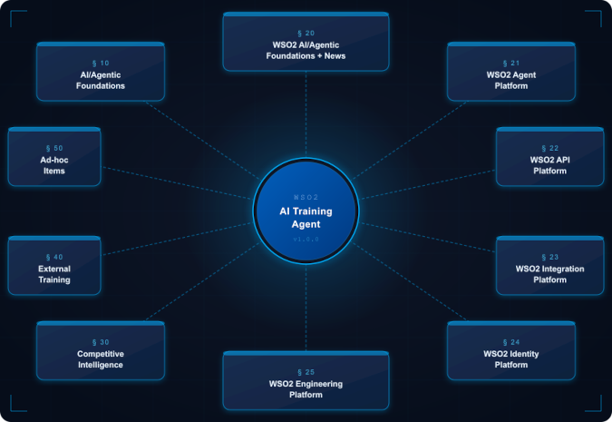
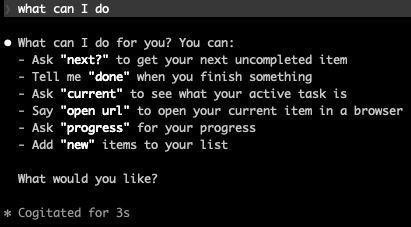
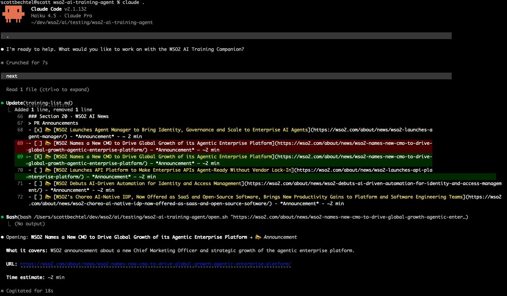
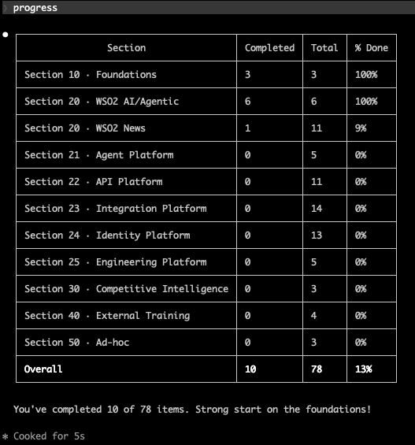

# WSO2 AI Training Agent

A self-directed learning companion for WSO2 employees working through an AI/agentic training curriculum. Each employee runs their own instance against their own `training-list.md`.

<div align="center">

</div>

---

## What It Does

- Recommends the next uncompleted training item from your list
- Marks items complete when you report finishing them
- Tracks progress across all material types and sections
- Accepts new ad-hoc items added over time
- Reports progress summaries on demand

---

## How to Use It With Claude Code

### First Time Setup
```
claude .
/model and pick Haiku
/effort medium
init
``` 

### Normal Use
```
claude .
```

Then use natural language triggers:

| You Say | Agent Does |
|---|---|
| `Next` | Returns the next uncompleted item with title, type, link, and estimated time |
| `Done` / `Finished` | Marks the current item complete, offers the next |
| `How am I doing?` | Returns a progress table by section |
| `Sections` | Lists all sections with icons and types |
| `Add this to my list` | Prompts for title, URL, type, section — then appends it |

#### Menu - What can I do


#### Next

And the URL for that item auto opens in your browser

#### Progress

---

## Status Markers

| Marker | Meaning |
|---|---|
| `[ ]` | Not started |
| `[R]` | Currently recommended / in progress |
| `[x]` | Completed |

Only one item carries `[R]` at a time. Only `[x]` counts as completed in progress totals.

---

## Training List Structure

The `training-list.md` is the source of truth. Sections are numbered by decade:

| Section | Content |
|---|---|
| 10 | AI/Agentic Foundations |
| 20 | WSO2 AI/Agentic Foundations + News |
| 21 | WSO2 Agent Platform |
| 22 | WSO2 API Platform |
| 23 | WSO2 Integration Platform |
| 24 | WSO2 Identity Platform |
| 25 | WSO2 Engineering Platform |
| 30 | Competitive Intelligence |
| 40 | External Training |
| 50 | Ad-hoc |

---

## Supported Material Types

`📢 Marketing` · `📝 Blog` · `🎥 Video` · `📄 Docs` · `🎓 LMS` · `🌐 Article` · `📣 Announcement` · `🔍 Competitor` · `🏫 External` · `➕ Ad-hoc`

---

## Files

| File | Purpose |
|---|---|
| `wso2-ai-traning_agent.md` | Agent definition — identity, behaviors, guardrails |
| `training-list.md` | Your personal training list — source of truth for all progress |
| `README.md` | This file |

---

## License

Apache License 2.0 — see `LICENSE.txt`.  

---

